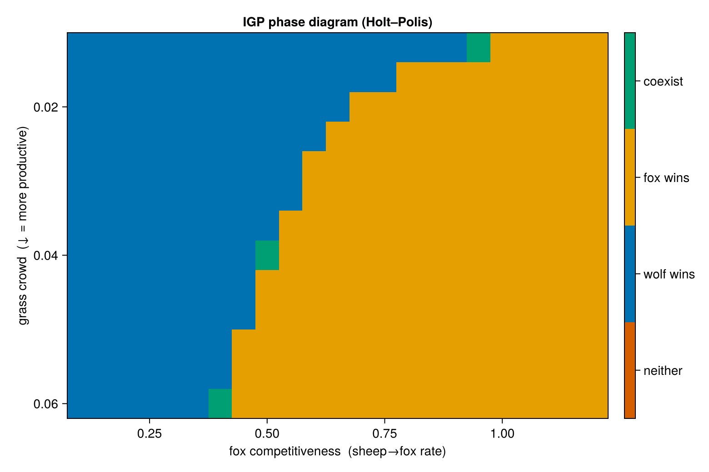

# ACT_SimLab

A **compositional simulation laboratory** in the [AlgebraicJulia](https://www.algebraicjulia.org/)
ecosystem. A deliberately minimal **Lotka–Volterra / Rosenzweig–MacArthur** ecology is the
*known-ground-truth testbed*; the project itself is the **system design around it** — a small, fixed
engine and the lab that surrounds it: a transparent forcing layer (`Scenario`), a currency-agnostic
dynamics engine, and a characterization layer that turns parameter- and structure-sweeps into regime
maps.

> **The engine is fixed and small; the lab is the product.** Everything that varies is a *forcing*;
> the harness is the complete, uniform surface of forcings, and *characterization* — what regimes
> emerge — is the output.



---

## The idea

Composition is **functorial** — open systems assemble lawfully and at scale. But **behavior emerges**:
the qualitative dynamics of a composite are not a simple function of its parts'. The categorical
machinery makes the *structure* rigorous and grounded so the *emergent behavior* can be studied
cleanly — treating dynamics and relationships as first-class objects, minimizing implementation bugs
and the design-pattern bloat that obscures what we're trying to study.
(See [`docs/compositionality.md`](docs/compositionality.md).)

Working principles:

- **Minimal model, maximal methods.** The model stays trivial (LV/RM) so any rich behavior is
  attributable to the *methods*, and method-correctness can be checked against the analytic solution.
- **Characterization is the product.** The measurement layer — emergence detection, regime
  classification, a *morphospace* of composition → phenotype — is the open frontier and the aim.
- **The harness is the surface.** A transparent, finite set of forcings (parameters, structure,
  vocabulary), opened to sweeping and modular composition. This is also a clean surface for
  AI-assisted development: verifiable mechanics (conservation gates, analytic ground truth) keep the
  code honest, and the forcing layer gives an agent a definite place to experiment, compose, and
  decompose sub-systems for simple verification.

## Architecture

The system design, in four moves:

- **A currency-agnostic engine.** One rule — *Liebig-limited growth over `K` conserved currencies* —
  spans one-currency biomass models and two-currency energy+nutrient webs (K ≥ 3 later). Conservation
  is a **gate**, not a hope.
- **`Scenario` — the single forcing layer.** Species (nodes), exchanges (typed edges), currencies,
  initial state: *all forcings*. Adding a species and sweeping a rate are the same operation — editing
  the Scenario. The **intervention ladder**: L1 parameters · L2 structure · L3 vocabulary.
- **Characterization.** `classify` labels a run's regime; `sweep2` maps regimes over Scenario axes
  into **phase diagrams**. The thing you'd otherwise tune by hand becomes a figure.
- **Two engines, so far.** The K-currency **population harness** (Scenarios) and the **Decapodes/DEC
  field** engine; `Para(Optic)` **agents** are the planned third. The repo mirrors this split.

## Selected results

Each is one `experiments/<id>/run.jl` away, and carries a conservation- or known-result **gate**:

| experiment | finding |
|---|---|
| [`igp-phase-diagram`](experiments/igp-phase-diagram/) | a **Holt–Polis phase diagram** from the harness: role-reversal boundary, productivity tilt, coexistence knife-edge (the image above) |
| [`biomass-pyramid`](experiments/biomass-pyramid/) | conversion efficiency ε *sets* the predator:prey ratio — the pyramid is emergent, not imposed |
| [`trophic-chain`](experiments/trophic-chain/) | standing biomass = flow × residence time — biomass needn't pyramid even when energy flow does |
| [`lv-two-species`](experiments/lv-two-species/) | the LV neutral cycle — the "tracer" |
| [`field-tritrophic`](experiments/field-tritrophic/) | tri-trophic as a Decapode *field*; 2-D emergent grazing-wave patterns |

The minimal **testbed** stays validated against closed form — LV neutral cycle; grass + prey *is* LV
one trophic level down; tri-trophic collapse; **Rosenzweig–MacArthur** coexistence with equilibria
matching analytics *to the digit* — the ground truth that keeps the methods honest.
See [`experiments/README.md`](experiments/README.md) for the full index.

## Repository layout

The repo **mirrors the software**: the engine is fixed and small; everything that varies is a
*forcing*. So the directory split *is* the conceptual split.

- **`src/`** — the engine + harness (the (mostly) invariant machinery). `using SimLab` exposes the
  `Scenario` layer, the currency-agnostic engine (`run_scenario`), and characterization
  (`classify`, `sweep2`).
- **`experiments/`** — the forcings layer made physical. Each subdir is one experiment =
  a `Scenario` + a procedure + **co-located outputs**. *An experiment directory ↔ a Scenario instance.*
- **`tools/`** — interactive instruments (dashboards, viz): *readers* of the harness.
- **`docs/`** — the conceptual layer (`journal.md`; `compositionality.md`, `community_modules.md`,
  `dynamics_field_guide.md`).

## Running an experiment

```
julia --project=. experiments/<id>/run.jl      # writes experiments/<id>/outputs/
```

See [`experiments/README.md`](experiments/README.md) for the index. Start with
[`experiments/igp-phase-diagram/`](experiments/igp-phase-diagram/) — the Holt–Polis IGP phase diagram,
produced entirely by the harness (`Scenario → sweep2 → figure`).

## Status & roadmap

- **Built & validated:** the currency-agnostic engine + `Scenario` / `classify` / `sweep2` harness;
  the experiments above; both the population and the DEC-field engines.
- **Planned** (READMEs already in `experiments/`): `grass-prey-predator` (RM), `two-currency-engine`
  and `two-currency-web` (rebuild on the harness), and an `experiments/run_all.jl` regression runner
  (experiments as tests).
- **Frontier:** `Para(Optic)` **agents** as the third engine, and richer characterization
  (morphospace slices).

*Built with [Catlab](https://github.com/AlgebraicJulia/Catlab.jl),
[AlgebraicPetri](https://github.com/AlgebraicJulia/AlgebraicPetri.jl),
[Decapodes](https://github.com/AlgebraicJulia/Decapodes.jl), and
[DifferentialEquations.jl](https://github.com/SciML/DifferentialEquations.jl).*
