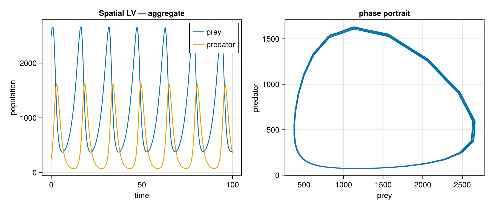

# ACT_SimLab

A **compositional simulation laboratory** built in the [AlgebraicJulia](https://www.algebraicjulia.org/)
ecosystem. It uses a deliberately minimal **Lotka–Volterra / Rosenzweig–MacArthur** ecology as a
*known-ground-truth testbed* for exercising categorical-systems concepts — typed
Petri nets and stratification, continuous (Decapodes) fields, and `Para(Optic)` agents.

---

## The idea

Composition is functorial — you can assemble open systems lawfully and at scale. But behavior
emerge: the qualitative dynamics of a composite are not a simple function of its parts'. The
categorical machinery makes the structure rigorous and grounded so that the emergent behavior can be studied while minimizing implementation bugs or grappling with design patterns that bloat and obfuscate what we're trying to study and treats dynamics and relationships as first class objects. 
(See [`docs/compositionality.md`](docs/compositionality.md).)

Current pattern:

- **Minimal model, maximal methods.** The model stays trivial (LV/RM) so that any rich behavior is
  attributable to the methods, and method-correctness can be checked against the analytic solution.
- **Characterization is the product.** The measurement layer — emergence detection, regime
  classification, a *morphospace* of composition → phenotype — is the open frontier and the aim. 

A harness on dimensions and parameters exposes a transparent and finite set of variables in the system and opens them up to parameter sweeping and modular additions to the system.

Part of this transparency and verification on the mechanics (justifying the formal model) is to also create a better surface for leveraging AI assisted development. The mechanics are verifiable, so the code is limited in how sloppy it can get and containing bugs. The parameter and dimension harness and composibility provides a more definite surface for agentic development to easily experiment with parameter sweeping, and compose or decompose sub systems for simple verification.

Validated against closed-form **ground truth**:

| model | result |
|---|---|
| Lotka–Volterra | neutral predator–prey cycle (the "tracer") |
| grass + prey | *is* LV one trophic level down (identical numbers) |
| tri-trophic (exponential grass) | predator collapse — the fragility |
| **Rosenzweig–MacArthur** (grass carrying capacity) | coexistence rescued; equilibria match analytics **to the digit** |

## To-Do 
Over-engineer the LV model and add in a decapode field effect for resource flow and transition population dynamics to Para(Optic) agents.

*Built with [Catlab](https://github.com/AlgebraicJulia/Catlab.jl),
[AlgebraicPetri](https://github.com/AlgebraicJulia/AlgebraicPetri.jl), and
[DifferentialEquations.jl](https://github.com/SciML/DifferentialEquations.jl).*
