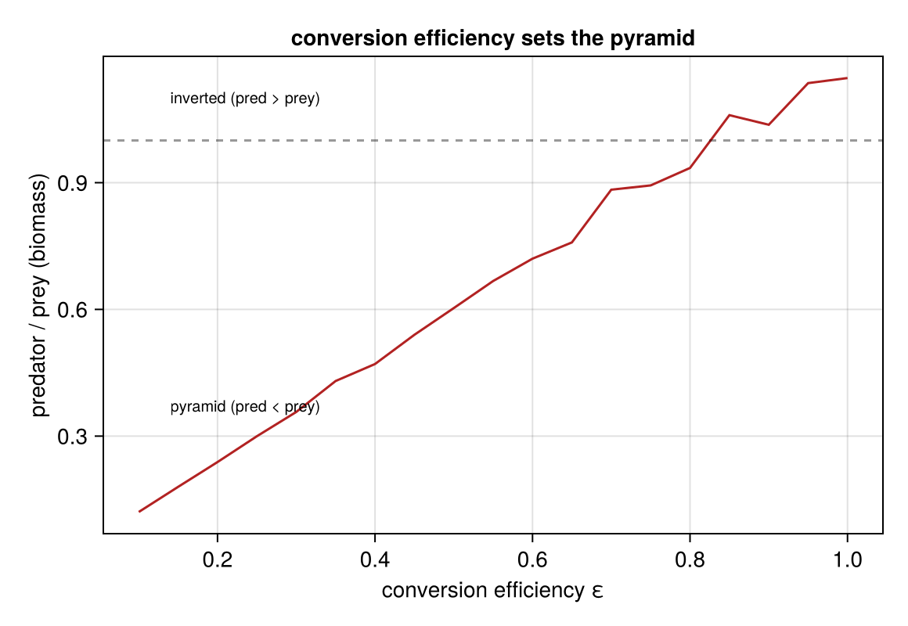

# Biomass Pyramid

**Status:** validated
**Question:** Does conversion efficiency ε control whether standing biomass pyramids
(predator < prey) or inverts?

## Scenario
LV (prey + predator, free food) **swept over conversion efficiency ε ∈ [0.1, 1.0]**; the
time-averaged predator/prey ratio is recorded per ε.

## Run
`julia --project=. experiments/biomass-pyramid/run.jl` → `outputs/pyramid.png`.
**Gate:** pyramid at low ε, inverted at high ε, conserved.

## Result
predator/prey ≈ **εα/γ** — linear in ε. At Lindeman ε = 0.1 the predator sits ~8× below prey
(pyramid); by ε = 1 it inverts. The pyramid is a *consequence* of the efficiency, not imposed.

## Notes
The conserved-currency account of why predators are rarer. See [`docs/journal.md`](../../docs/journal.md) (2026-06-07).
