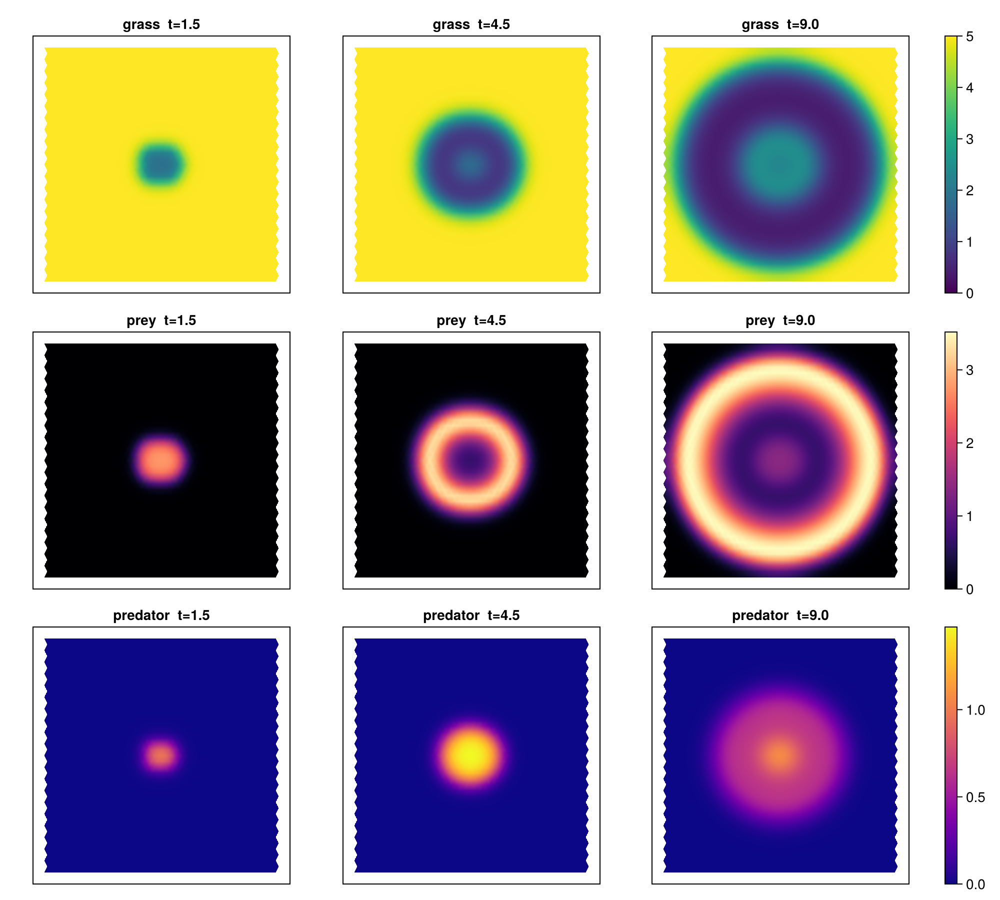

# Field Tri-Trophic (Decapodes engine)

**Status:** migrated — **DEC field engine**; paths co-located, re-verify before trusting.
**Question:** Does grass/prey/predator expressed as a Decapode reproduce the analytic equilibrium,
and what spatial patterns emerge in 2-D?

## Scenario / steps
- `field_decapode.jl` — tri-trophic as a `@decapode`; uniform → closed-form equilibrium (rel.err 0).
- `field_decapode_spatial.jl` — 2-D spatial run; emergent target pattern (prey invasion ring, predator lag).
- `field_anim.jl` — animated 2-D field (MP4).

## Run
`julia --project=. experiments/field-tritrophic/field_decapode.jl` (etc.) → `outputs/`.

## Result
The Decapode reproduces the RM equilibrium to machine precision; 2-D shows concentric grazing waves
with a trophic spatial lag.

## Notes
The **field engine** track (Decapodes). See `docs/journal.md` (2026-06-06/07).
