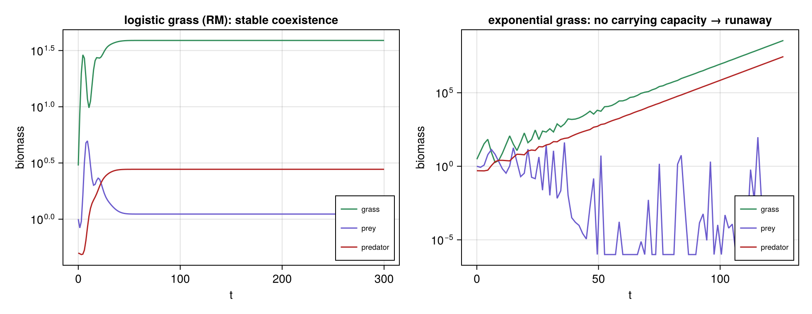
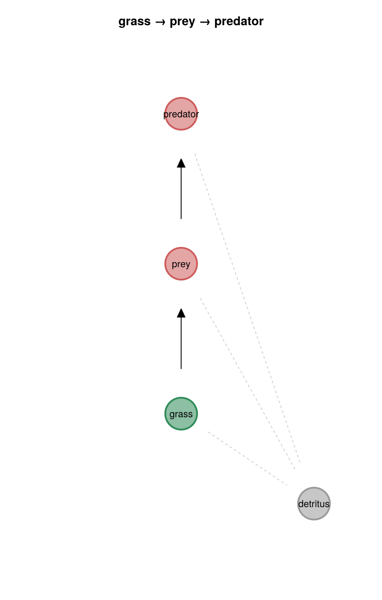

# Grass–Prey–Predator (RM coexistence)

**Status:** validated
**Question:** Does a carrying capacity (logistic grass) stabilize tri-trophic coexistence — and what
happens without one?

## Scenario
One-currency biomass chain `grass → prey → predator`, run two ways: **logistic grass** (a carrying
capacity, `crowd > 0`) vs **exponential grass** (`crowd = 0`). The composition is also rendered as a
food-web graph via the shared `tools/composition.jl`.

## Run
`julia --project=. experiments/grass-prey-predator/run.jl` → `outputs/{dynamics,composition}.png`.
**Gate:** with logistic grass, all three coexist (`regime == :fixed`) and biomass is conserved.

## Result
- **Logistic grass → stable bounded coexistence** — grass/prey/predator damp to a fixed point.
- **Exponential grass → runaway** — with no carrying capacity, grass and predator grow *unboundedly*
  while the **prey (middle level) crashes** into wild near-extinction oscillations. No stable
  coexistence.

So the carrying capacity doesn't merely bound grass — it **stabilizes the whole chain**. (This is the
Rosenzweig–MacArthur stabilization point; the sustained limit cycle / paradox of enrichment proper
needs a saturating **Type II** response — a future engine primitive.)

**Composition graph** — the food web (solid "eats" arrows by trophic level) + the detritus sink
(dashed loss edges):

## Notes
First experiment to emit a **composition graph** as an output — via `tools/composition.jl`, a reusable
reader that renders *any* `Scenario`'s structure. See `docs/journal.md` and
[`docs/dynamics_field_guide.md`](../../docs/dynamics_field_guide.md) (Rosenzweig–MacArthur).
