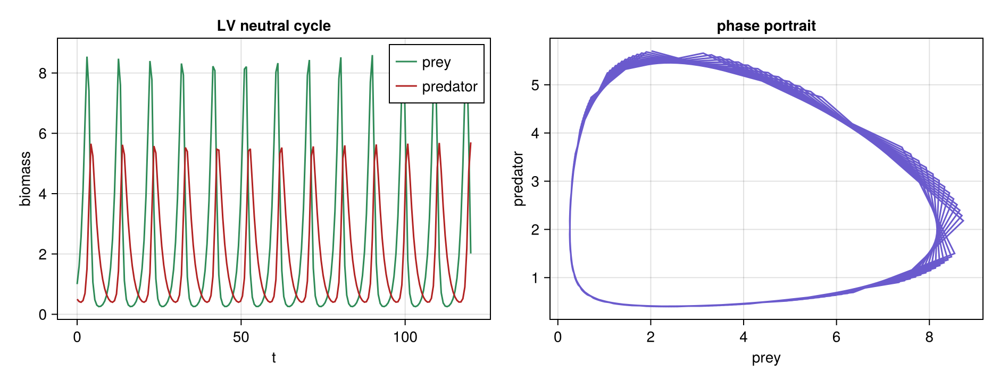

# LV Two-Species (the tracer)

**Status:** validated
**Question:** Does the harness reproduce the textbook Lotka–Volterra neutral predator–prey cycle?

## Scenario
One-currency (biomass): **prey as a producer with free food** (exogenous birth, *no* carrying
capacity) + a **predator** consuming it. The absence of any density dependence is what makes the
orbit neutral.

## Run
`julia --project=. experiments/lv-two-species/run.jl` → `outputs/lv_cycle.png`.
**Gate:** `classify` reports `regime == :cycle` and bookkeeping conserved.

## Result
The classic **neutral closed orbit** — sustained oscillation, predator lagging prey, amplitude set by
initial conditions. The tracer: perfect neutral cycles ⇒ no density dependence anywhere.

## Notes
The minimal harness demo. See [`docs/dynamics_field_guide.md`](../../docs/dynamics_field_guide.md) (Lotka–Volterra).
