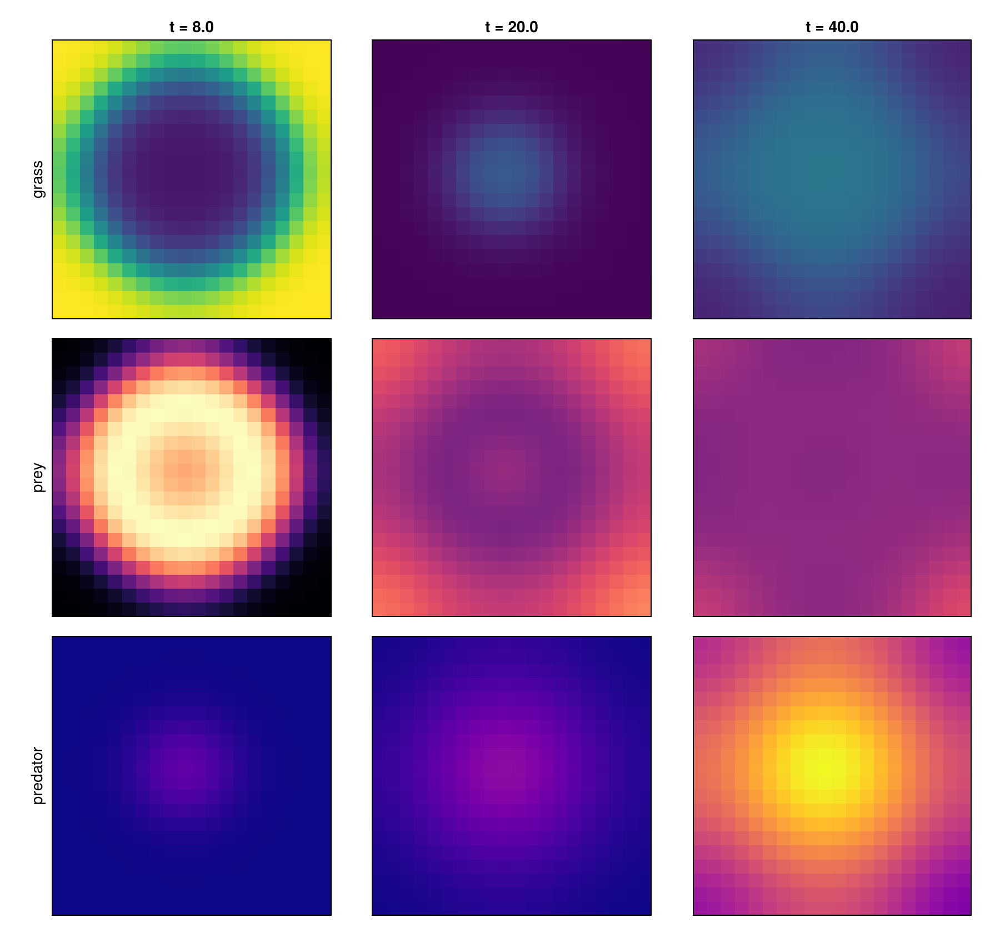

# Spatial Food Web

**Status:** validated
**Question:** Does the currency harness reproduce a spatial invasion wave when a `Scenario` is
distributed over a grid with diffusing consumers — conserving globally?

## Scenario
A `K=1` `grass → prey → predator` Scenario **distributed over a 20×20 grid** via the harness spatial
layer (`run_spatial`): one copy of every pool per tile; grass logistic & immobile; prey/predator
**mobile** (diffuse between 4-neighbours). Prey + predator seeded in a central patch; grass at
carrying capacity everywhere.

## Run
`julia --project=. experiments/spatial-foodweb/run.jl` → `outputs/{spatial,composition}.png`.
**Gate:** biomass conserved across the whole grid (open-currency drift `< 1e-6`).

## Result
A spatial **tri-trophic invasion** (drift ~1e-15 over 400 tiles): prey spreads outward from the seed,
grazing a **depletion front** in the grass; the predator builds up in the wake (centre) with a
**trophic spatial lag**; grass recovers behind the front as the predator controls the prey. The same
emergent target-pattern as the DEC field demo — now on the **population** engine, from a plain
Scenario plus a diffusion rate.

## Notes
First experiment on the **spatial harness** (`generate_spatial` / `run_spatial`): the well-mixed
Scenario is the per-tile subsystem; spatializing = replicate per tile + diffuse mobile pools — the
same stratification idea used on the Petri engine, hand-built on the currency representation. *Any*
harness Scenario can now be made spatial. See [`docs/engines.md`](../../docs/engines.md).
