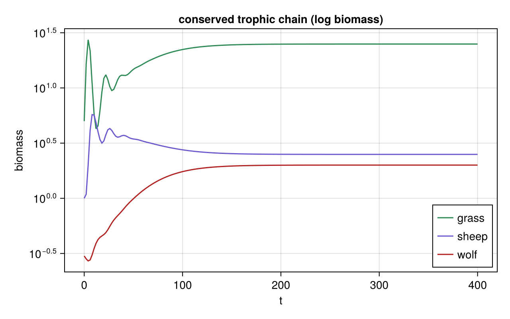

# Trophic Chain

**Status:** validated
**Question:** What standing biomass emerges from a conserved chain grass→sheep→wolf with Lindeman ε,
and does it pyramid?

## Scenario
One-currency biomass chain: **logistic grass** (carrying capacity) → sheep → wolf; **ε = 0.1** per
feeding link (Lindeman); losses to a detritus sink.

## Run
`julia --project=. experiments/trophic-chain/run.jl` → `outputs/chain.png`.
**Gate:** all three persist + conserved.

## Result
grass 25 ≫ sheep 2.5 ≈ wolf 2.0. Every *flow* obeys Lindeman (10 %/link), but **standing biomass =
flow × residence time**, so the long-lived wolf rivals the sheep in biomass — biomass needn't pyramid
even when energy flow does.

## Notes
See [`docs/community_modules.md`](../../docs/community_modules.md) (food chain) and the field guide.
